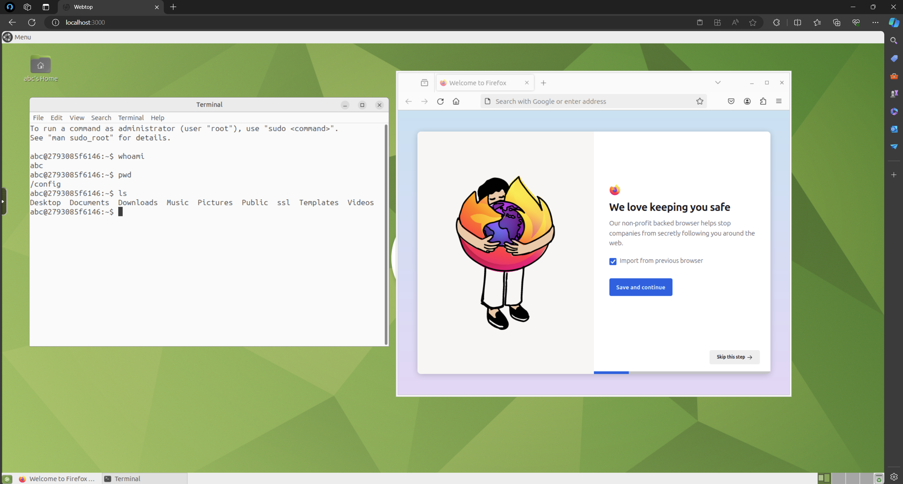
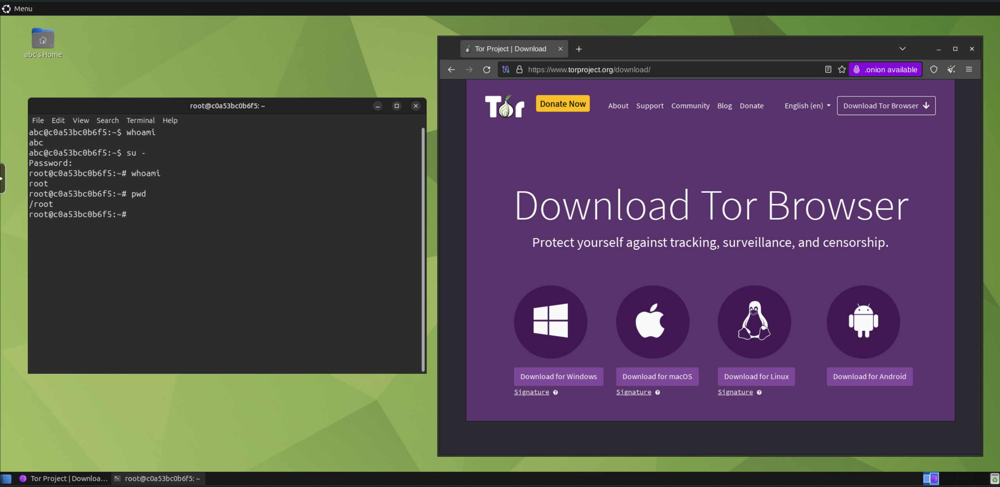

# WebTop

### This is a web browser GUI-based Linux OS system that runs on a docker container

#### Linuxserver.io dock
~~~url
https://docs.linuxserver.io/images/docker-webtop/
~~~

#### Docker Hub
~~~url
https://hub.docker.com/r/linuxserver/webtop
~~~

#### How to start
* In this project, i use Ubuntu-mate image
* Before run this set PUID and PGID in your PC, it can get running "id" command in CMD
* To start container
~~~sh
docker compose up -d
~~~
* To stop container
~~~sh
docker compose down
~~~

 

 

#### How to install Tor
* To install Tor Browser automatically, run the tor_installer.sh file in the apps directory. 
~~~sh
sh /config/apps/tor_install.sh
~~~
* Or double click "tor_install.sh" file

 

 

#### How to install Libreoffice
* To install Libreoffice automatically, run the libreoffice_installer.sh file in the apps directory. 
~~~sh
sh /config/apps/libreoffice_install.sh
~~~
* Or double click "libreoffice_install.sh" file

 

 

#### How to install Java
* To install Java automatically, run the java_installer.sh file in the apps directory.
* If you need to install a specific version check java_installer.sh and set up it
* This file install JDK 17 version default 
~~~sh
sh /config/apps/java_install.sh
~~~
* Or double click "java_install.sh" file